# Joseph Yang CSE241 Final Project

## Project Overview
The purpose of this project create and implement a real-life scenario in this case, it would be controlling the traffic lights for the highway and the country road. We need to create our own Moore finite state machine to simulate a proper traffic light that shouldn't cause any vehicle collisions under the assumption the behavior of the driver is ideal and there are no external factors. Finally, we will implement and test it by using D-FlipFlops in our design and write SV code to simulate the same thing.

**Things to consider:**
* There is a highway road and country road
* The two roads intersect perpendicularly 
* The traffic signals for each road can only be red or green, so yellow doesn't exist in this situation
* Both signals cannot be green at the same time but both can be red
* The counting sensor, weather sensor, and sensor enable are used to determine the colors of the traffic light
* If either the counting sensor or the sensor enable is off, country road will have red light
* Counting sensor is always on unless it is snowing
* Weather sensor tells if it is snowing or not
* When changing signals both signals must be temporarily be red to avoid collisions

**Overall Idea**
Essentially two traffic lights, highway and country road, will only be red or green and it's determined by counting sensor, weather sensor, and sensor enable. If either counting sensor or sensor enable is off, country is red no matter what. Both traffic lights cannot be green but can be both red and when changing signals both lights must be red temporarily.

### State Diagram
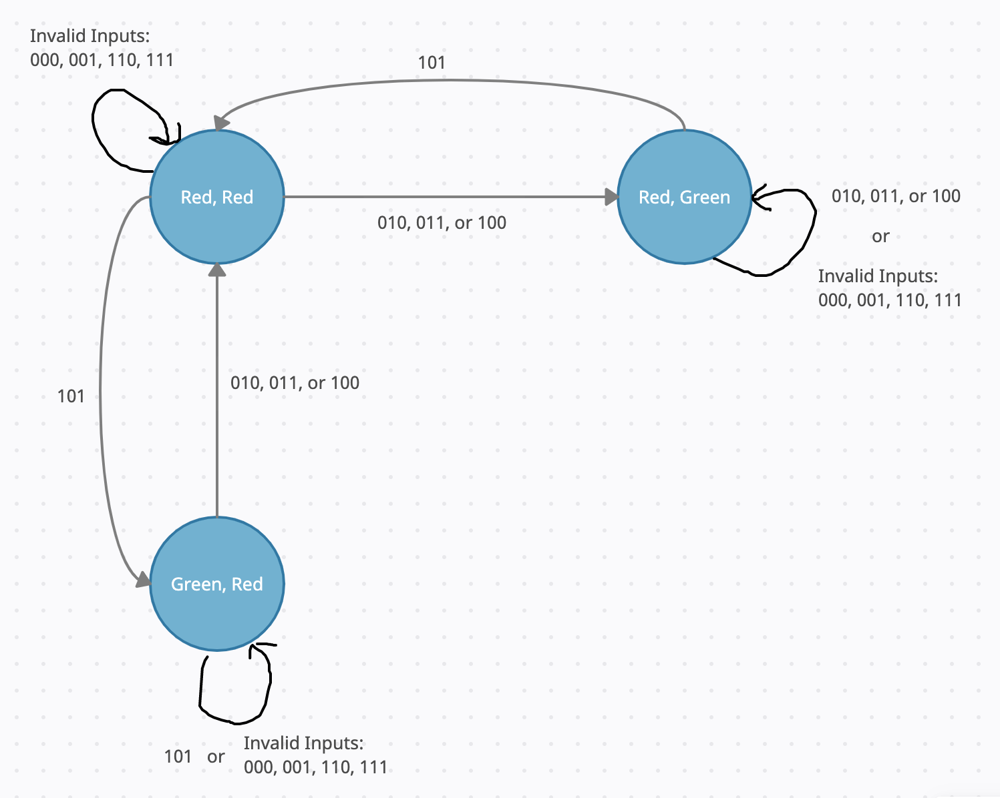

**State: (Country Road Signal, Highway Road Signal)**

**Inputs: (Counting Sensor, Weather Sensor, Sensor Enable)**

**Description:**
The State and Inputs correspond to the written parameters. My state diagram has only 3 states since we cannot include a state when both the country and highway are green. To have both signals temporarily red the diagram does not have any direct transition from (Green, Red) to (Red, Green) vise versa. Note that if either the counting sensor or sensor enable is off then the only time when the country is green is if the input is 101 or it's transitioning towards country green. If we receive any "invalid inputs" like when it's snowing and the counting sensor is still on, then just have all the states point to themselves to pretend nothing happened.

### State Table
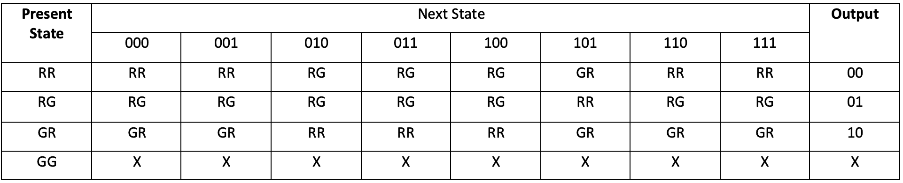

**Description:**
The present state represents R(Red light) and G(Greenlight), in the form (Country Signal, Highway Signal). The inputs are the same as the state diagram being (Counting Sensor, Weather Sensor, Sensor Enable) bits. And the outputs are in 0's(red light) and 1's(green light) representing (Country Signal, Highway Signal). Since the row for GG doesn't exist, I left every input in that row as don't cares. Also, there are a few inputs that don't exist such as bits when it is snowing but the counting sensor is on, so I left that column point to itself.

### Transition Table
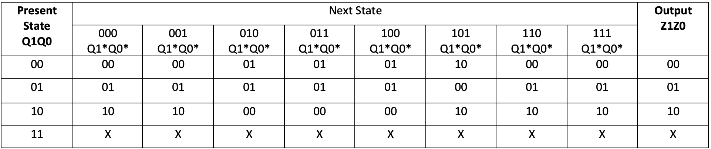
**State assignments: RR=00  RG=01  GR=10  GG=11**

### Transition Equation
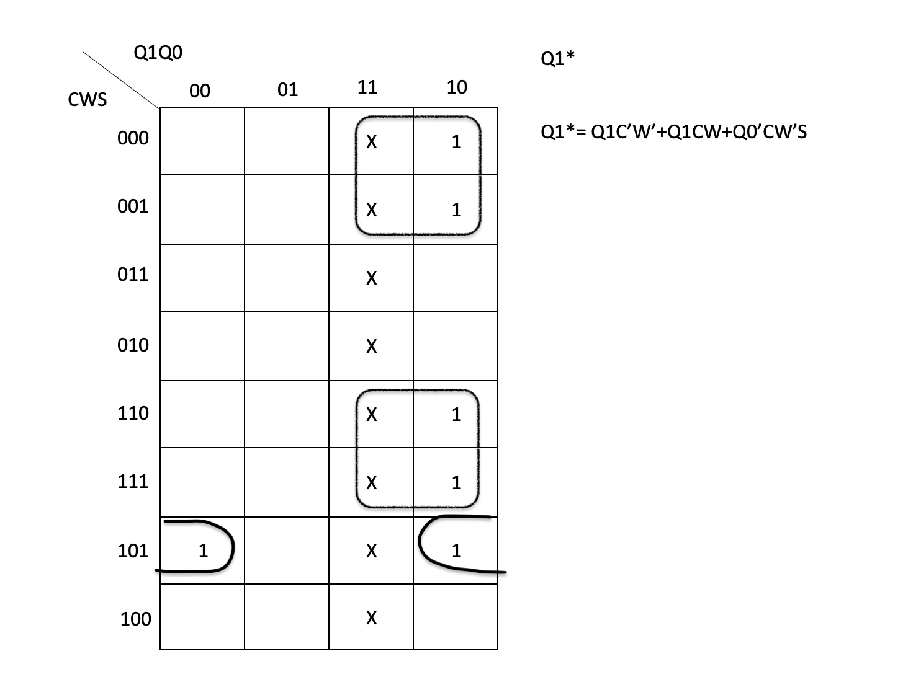
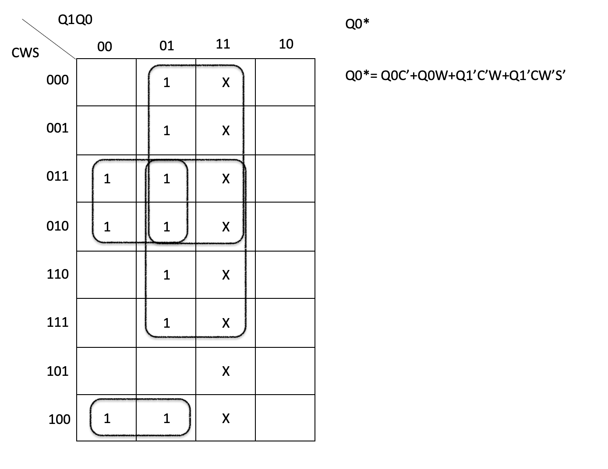
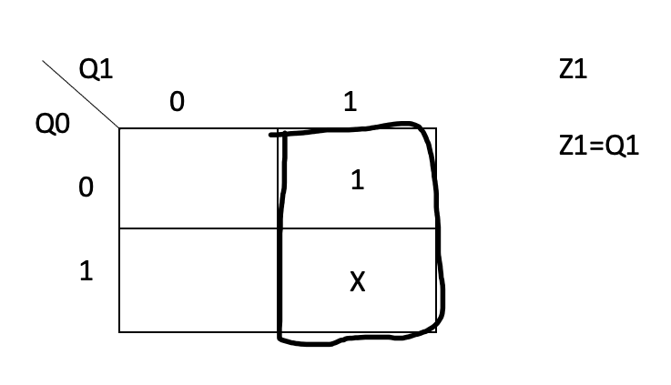
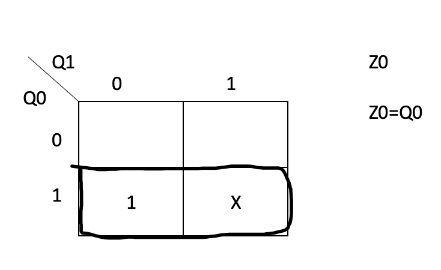

**Notice:**
Z1 equation reqpresents the output of the country light bit and the Z0 represents the output of the highway light bit. Above is shown the transitions equation through the use of K-Maps.

### Bill Of Materials
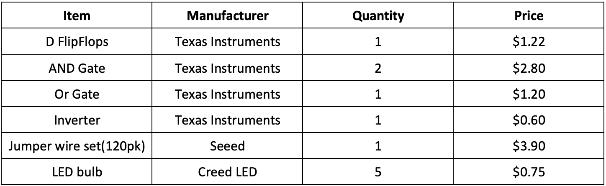


### Schematic
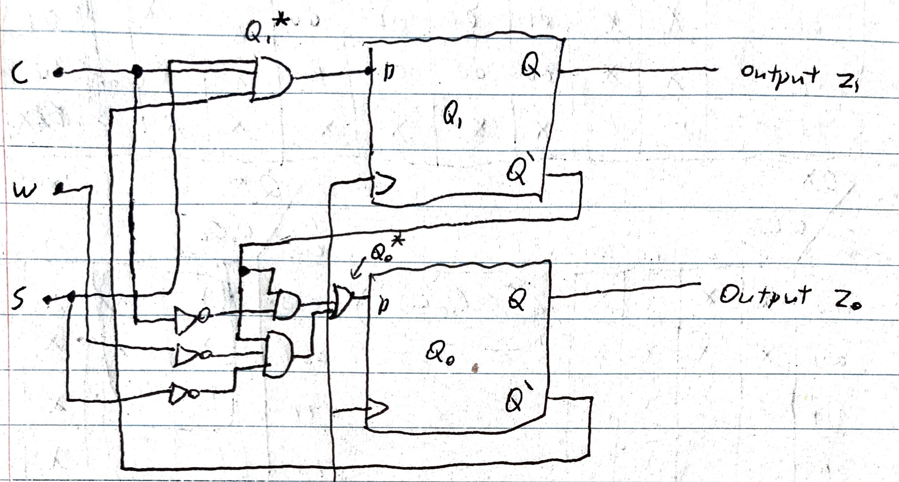

**Description:**
Make use of the transition equation solved from above and have that implmented using D-FlipFlop. It should give us 2 outputs, Z1 represesnts the country light and Z0 represents the highway light.

**The 8 test cases:**
* We need to make sure whenever the light changes it needs both lights to be red temporarily and both cannot be green at the same time
* See if both the counting sensor and sensor enable is on (red, red) should go to (green, red)
* See if both the counting sensor and sensor enable is on (red, green) should go to (red, red)
* See if both the counting sensor and sensor enable is on (greed, red) should stay the same
* If either the counting sensor or sensor enable is off then (red, red) should go to (red, green)
* If either the counting sensor or sensor enable is off then (green, red) should go to (red, red)
* If either the counting sensor or sensor enable is off then (red, green) should stay the same
* Any invalid inputs should not change the traffic lights

### The Verilog Code
**design.sv file**
```verilog
// Code your design here
//Name: Joseph Yang
//Date: 5/16/2022
//Assignment: Final Project 
//Purpose: Write SV code for the traffic light
`timescale 1ns/100ps
module Final_Project(Q1,Q0,C,W,S,Z0,Z1);
  input Q1,Q0,C,W,S;//get input sensor
  output Z0, Z1;//git output bits
  wire q1n, q0n, wn, cn, sn;//NOT wires
  wire p1, p2;//for the equation z0
  not(q1n, Q1);//use not on all inputs
  not(q0n, Q0);
  not(cn, C);
  not(wn, W);
  not(sn, S);
  
  and(Z1, q0n, wn, S);//output
  
  and(p1, q1n, cn);//first term for Z0
  and(p2, q1n, sn);//second term for Z0
  
  or(Z0, p1, p2);//output
  
endmodule
```
**testbench.sv**
```verilog
// Code your testbench here
// or browse Examples
`timescale 1ns/100ps
module t_Final_Project;//module for testbench
reg Q1, Q0, C, W, S;//input reg
wire Z0, Z1; //output on wires
  Final_Project instname(.Q1(Q1), .Q0(Q0), .C(C), .W(W), .S(S), .Z0(Z0),.Z1(Z1));//call the function
  
  initial//set the inputs to 0
    begin
      Q1=0;
      Q0=0;
      C=0;
      W=0;
      S=0;
    end
  always
    begin//setting up the truth tables
      #5 S=1;
      #5 S=0;W=1;
      #5 S=1;
      #5 C=1;W=0;S=0;
      #5 S=1;
      #5 S=0;W=1;
      #5 S=1;
      #5 Q0=1;C=0;W=0;S=0;
      #5 S=1;
      #5 S=0;W=1;
      #5 S=1;
      #5 C=1;W=0;S=0;
      #5 S=1;
      #5 S=0;W=1;
      #5 S=1;
      #5 Q1=1;Q0=0;C=0;W=0;S=0;
      #5 S=1;
      #5 S=0;W=1;
      #5 S=1;
      #5 C=1;W=0;S=0;
      #5 S=1;
      #5 S=0;W=1;
      #5 S=1;
      #5 Q0=1;C=0;W=0;S=0;
      #5 S=1;
      #5 S=0;W=1;
      #5 S=1;
      #5 C=1;W=0;S=0;
      #5 S=1;
      #5 S=0;W=1;
      #5 S=1;
      #5 Q1=0;Q0=0;C=0;W=0;S=0;
    end
  initial
    begin
      //seperate from warnings
      $display("-----------------------------------------------");
  //header row
      //output once
      $display("Q1\tQ0\tC\tW\tS\t\tCountry\tHighway");
     
      $monitor("%b\t%b\t%b\t%b\t%b\t\t%b\t%b",Q1,Q0, //Start the monitor
               C,W,S,Z1,Z0); //finish the monitor variables
    end
  //set up waveform
  initial
    begin
      //create file
      $dumpfile("aferkrgkejrhhjwg.vcd");
      //associate dumping the variables
      $dumpvars;
    end
initial #155 $finish;
//close module

endmodule//end the module
```
### Analysis Plan
**Verification:**
In order to know if the design is correct is to compare the log output from below and compare it to the transition table. It shows that the results match completely.
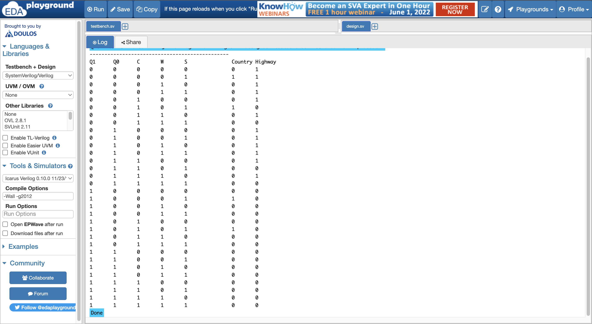

**Waveform of inputs/outputs**
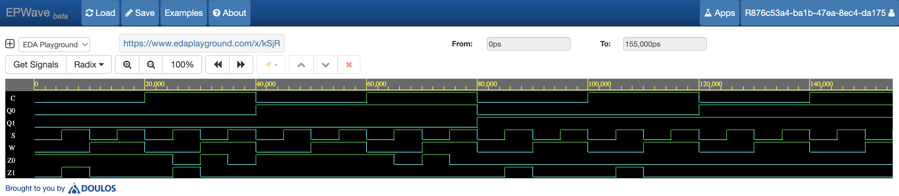

## Conclusion
In conclusion, simulating two traffic signals requires many steps to be implemented. We first have to indicate the design problem and filter out the unnecessary parts. Create a state diagram of which states exists and don't exist and somehow use the three inputs that determine the traffic lights. Create a state table from the diagram and turn it into a transition table. Create a transition equation from the table and use that to create a schematic using a D-FlipFlop. Implement the schematic and create the SV code to simulate the same thing. Overall the outcome of my project is somewhat successful in the way that all the requirements have been met but the actual implementation by putting it into a breadboard is troubling since somethings the LED bulb light up when it's supposed to be other time it doesn't.


This project was designed and implemented by Joseph Yang in Spring 2022 for CSE241 at the University at Buffalo. Content in this repository is not to be reproduced or utilized without written authorization from the instructor, Dr. Winikus (jwinikus@buffalo.edu).
# Traffic-Light
